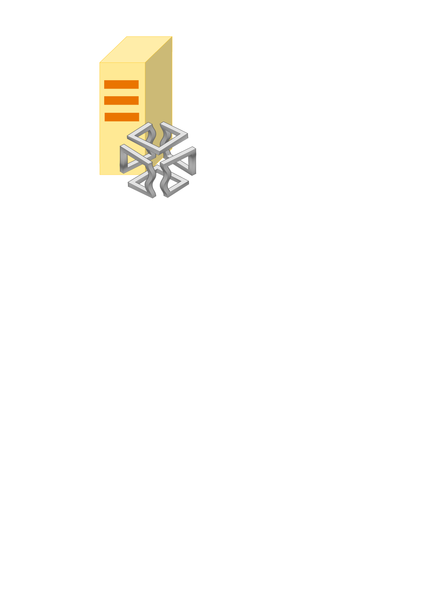

<div id="top"></div>

[![Contributors][contributors-shield]][contributors-url]
[![Forks][forks-shield]][forks-url]
[![Stargazers][stars-shield]][stars-url]
[![Issues][issues-shield]][issues-url]


<br />
<div align="center">
  <a href="https://github.com/mattianeroni/server-side-algorithms">
    
  </a>
  
  <h1 align="center">Server Side Algorithms</h1>
  
  <p align="center">
    Server Side Algorithms (SSA) is a platform with the objective to cover the gap between applications developers and scientists. Through a standard API described in our documentation (a link will be available soon), the registered developers are allowed to send a HTTP request to our server by requiring the execution of a specific algorithm on the provided data. These requests will be processed in real time and there is no limit to the number of requests a registered user can make. In this way, developers with no scientific background 
    <br />
    <br />
    <a href="https://github.com/mattianeroni/server-side-algorithms"><strong>View Web Site</a>
    <br />
  </p>
</div>


<!-- TABLE OF CONTENTS -->
<details>
  <summary>Table of Contents</summary>
  <ol>
    <li>
      <a href="#about-the-project">About The Project</a>
      <ul>
        <li><a href="#built-with">Built With</a></li>
      </ul>
    </li>
    <li>
      <a href="#getting-started">Getting Started</a>
      <ul>
        <li><a href="#prerequisites">Prerequisites</a></li>
        <li><a href="#installation">Installation</a></li>
      </ul>
    </li>
    <li><a href="#usage">Usage</a></li>
    <li><a href="#roadmap">Roadmap</a></li>
    <li><a href="#contributing">Contributing</a></li>
    <li><a href="#license">License</a></li>
    <li><a href="#contact">Contact</a></li>
    <li><a href="#acknowledgments">Acknowledgments</a></li>
  </ol>
</details>


## About The Project

[![Product Name Screen Shot][product-screenshot]](https://example.com)

Here's a blank template to get started: To avoid retyping too much info. Do a search and replace with your text editor for the following: `github_username`, `repo_name`, `twitter_handle`, `linkedin_username`, `email_client`, `email`, `project_title`, `project_description`

<p align="right">(<a href="#top">back to top</a>)</p>


### Built With

* [FastAPI](https://fastapi.tiangolo.com/)

<p align="right">(<a href="#top">back to top</a>)</p>


## Usage

This is an example of how you may give instructions on setting up your project locally.
To get a local copy up and running follow these simple example steps.

### Prerequisites

* FastAPI
  ```sh
  pip install fastapi
  ```

### Installation

1. Get a free API Key at [https://example.com](https://example.com)
2. Clone the repo
   ```sh
   git clone https://github.com/github_username/repo_name.git
   ```
3. Install NPM packages
   ```sh
   npm install
   ```
4. Enter your API in `config.js`
   ```js
   const API_KEY = 'ENTER YOUR API';
   ```

<p align="right">(<a href="#top">back to top</a>)</p>


<!-- USAGE EXAMPLES -->
## Usage

Use this space to show useful examples of how a project can be used. Additional screenshots, code examples and demos work well in this space. You may also link to more resources.

_For more examples, please refer to the [Documentation](https://example.com)_

<p align="right">(<a href="#top">back to top</a>)</p>


<!-- ROADMAP -->
## Roadmap

- [ ] Feature 1
- [ ] Feature 2
- [ ] Feature 3
    - [ ] Nested Feature

See the [open issues](https://github.com/github_username/repo_name/issues) for a full list of proposed features (and known issues).

<p align="right">(<a href="#top">back to top</a>)</p>


## Contributing

Contributions are what make the open source community such an amazing place to learn, inspire, and create. Any contributions you make are **greatly appreciated**.

If you have a suggestion that would make this better, please fork the repo and create a pull request. You can also simply open an issue with the tag "enhancement".
Don't forget to give the project a star! Thanks again!

1. Fork the Project
2. Create your Feature Branch (`git checkout -b feature/AmazingFeature`)
3. Commit your Changes (`git commit -m 'Add some AmazingFeature'`)
4. Push to the Branch (`git push origin feature/AmazingFeature`)
5. Open a Pull Request

<p align="right">(<a href="#top">back to top</a>)</p>


## Contact

Mattia Neroni, Ph.D., Eng. - mneroni@unimore.it

Project Link: https://github.com/mattianeroni/server-side-algorithms

<p align="right">(<a href="#top">back to top</a>)</p>


## Acknowledgments

This project is completely self maintained.

<p align="right">(<a href="#top">back to top</a>)</p>


<!-- MARKDOWN LINKS & IMAGES -->
<!-- https://www.markdownguide.org/basic-syntax/#reference-style-links -->
[contributors-shield]: https://img.shields.io/github/contributors/mattianeroni/server-side-algorithms.svg?style=for-the-badge
[contributors-url]: https://github.com/mattianeroni/server-side-algorithms/graphs/contributors
[forks-shield]: https://img.shields.io/github/forks/mattianeroni/server-side-algorithms.svg?style=for-the-badge
[forks-url]: https://github.com/mattianeroni/server-side-algorithms/network/members
[stars-shield]: https://img.shields.io/github/stars/mattianeroni/server-side-algorithms.svg?style=for-the-badge
[stars-url]: https://github.com/mattianeroni/server-side-algorithms/stargazers
[issues-shield]: https://img.shields.io/github/issues/mattianeroni/server-side-algorithms.svg?style=for-the-badge
[issues-url]: https://github.com/mattianeroni/server-side-algorithms/issues
[linkedin-url]: https://www.linkedin.com/in/mattia-neroni-081965101/
[product-screenshot]: images/screenshot.png
